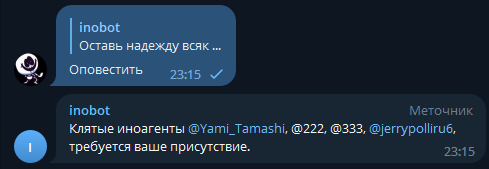

# inobot

## Описание
Телеграм-бот для чата, поддерживающий классовое неравенство.

## Возможности
- **Добавляет метку пользователю и выводит соответствующий ответ в зависимости от неё** - основной функционал проекта
- **Команда ```/start```** - старт и регистрация в базе данных бота. Если пользователь не был зарегистрирован, выдастся приветственное сообщение, иначе - уведомление, что пользователь в базе уже присутствует.
- **Команда ```/help```** - получение информации о командах бота.
- **Команда ```/Хто_я```** - информирует пользователя о его статусе и правах (является ли он администратором).
- **Команда ```/Госуслуги```** - вызывает меню с кнопками для контроля бота.
  - **Меню** содержит в себе 4 кнопки с различным функционалом.
    - **Кнопка ```Список иноагентов```** - осуществляет обращение к базе данных и выводит списком всех, кто отмечен как иноагент.
- - Функционал всех кнопок ниже доступен только обладателю статуса администратора.
    - **Кнопка ```Оповестить```** - аналогична предыдущей функции, но вместо списка выдаёт сообщение, в котором происходит упоминание всех отмеченных лиц.
    - **Кнопка ```Добавить иноагента```** - меняет в базе данных метку регалии "иноагент" на положительную для конкретного пользователя.
      - Для всех пользователей с такой меткой каждое их сообщение, не являющееся командой или вызовом кнопки помечается соответствующей плашкой.
    - **Кнопка ```Амнистировать иноагента```** - меняет в базе данных метку регалии "иноагент" на отрицательную для конкретного пользователя.
- ## Запуск проекта
- Для начала требуется склонировать репозиторий:

```git clone https://github.com/tengen-toppa-gurren-lagann/inobot.git```

- Потом следует выбрать один из видов запуска проекта, которые разобраны в главах ниже.
- После успешного запуска следует перейти в Telegram ```https://web-telegram.ru/```
- Создадим новый чат с нашим ботом, для этого найдите его по тегу ```@inoagentsbot```


- Нажимаем на кнопку ```start``` или вводим аналогичную команду и можем начинать пользоваться ботом. Весь функционал описан в разделе ```Возможности```

### Обычный запуск проекта
Запустите проект в среде PyCharm путем выбора необходимой папки (см. рис ниже):


Затем настройте интерпретатор Python, для этого перейдите ```File->Settings->Project:inobot->Python Interpreter``` и выполните следующую настройку:


Теперь следует добавить все необходимые библиотеки в проект, для этого следует в консоли ввести следующую команду:
```pip install -r requirements.txt```
Можно использовать консоль прямо из Pycharm, как показано ниже


Или же перейти в папку проекта и добавить их через обычную консоль, как показано ниже


Теперь откройте файл ```main.py``` и на строке 15 запустите бота:


Если при запуске возникли какие-то сбои, то для проверки перейдите в окно подключенных модулей и проверьте их в соответствии со следующим фото:

```File->Settings->Project:inobot->Python Interpreter```


### Запуск проекта при помощи Docker
При помощи командной строки перейдите в папку проекта и проверьте наличие всех файлов:
```cd PyCharmProjects/inobot```


Теперь создайте образ при помощи следующей команды:
```sudo docker build -t dockerfile .```


После создания образа его можно запустить в Docker Desktop:


## Пример работы проекта

Теперь перейдем в Telegram и найдем нашего бота:


Начнем работу:


Введём ```/help```:


Введём ```/Хто_я```:


Введём ```/Госуслуги```:


Если была нажата кнопка ```Список иноагентов```:


Если была нажата кнопка ```Оповестить```:



Если была нажата кнопка ```Добавить иноагента```:


Если была нажата кнопка ```Список иноагентов``` после этого:


Если была нажата кнопка ```Амнистировать иноагента```:


Если была нажата кнопка ```Список иноагентов``` после этого:


Сообщение, которое прикрепляет бот к пользователю, имеющему статус иноагента:  


